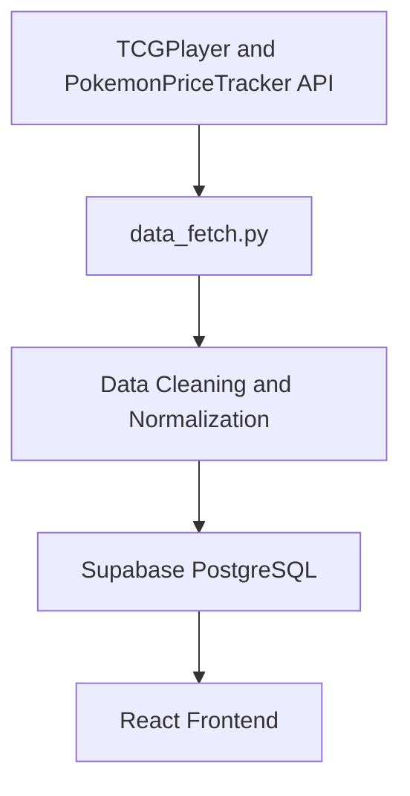

```mermaid
graph TD

    A[TCGPlayer and PokemonPriceTracker API] --> B[data_fetch.py]
    B[data_fetch.py] --> C[Data Cleaning and Normalization]
    C[Data Cleaning and Normalization] --> D[Supabase Postgre SQL]
    D[Supabase PostgreSQL] --> E[React Frontend]

```